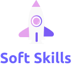
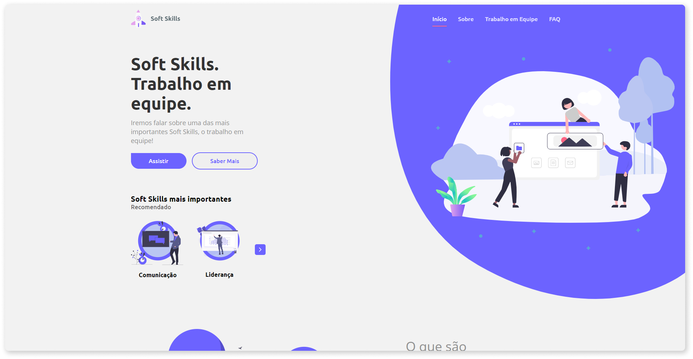

<h1 align="center">
    
     
    Soft Skills - Desafio Expansion Week
</h1>

  

  

  

  

<h4 align="center">
  Este é um projeto sobre <b>Soft Skills</b>, desenvolvido para o desafio do Expansion Week, um evento inédito - exclusivo para alunos do Bootcamp GoStack da RocketSeat - de encontros ao-vivo com pessoas e empresas que entendem muito sobre as habilidades que um dev precisa ter.
</h4>

  <a href="#-layout">Layout</a>&nbsp;&nbsp;&nbsp;|&nbsp;&nbsp;&nbsp;
  <a href="#rocket-technologies">Tecnologias</a>&nbsp;&nbsp;&nbsp;|&nbsp;&nbsp;&nbsp;
  <a href="#memo-license">Licença</a>

  

  

## 🎨 Layout

No link abaixo, você encontra o layout do projeto web em que desenvolvi para este site. Lembrando que você precisa ter uma conta no Figma para acessá-lo.

- [Layout Web](https://www.figma.com/file/Tyb2uKd53CVtCp7qPKLCU6/GoStack-Expansion-Week-Desafio?node-id=0%3A1)

## :rocket: Tecnologias

Esse projeto foi desenvolvido usando as seguintes tecnologias:

- [ReactJS](https://reactjs.org/)
- [Typescript][ts]
- [react-router-dom](https://github.com/ReactTraining/react-router)
- [react-icons](https://react-icons.github.io/react-icons/)
- [react-scroll](https://github.com/fisshy/react-scroll/)
- [react-modal-video](https://github.com/appleple/react-modal-video/)
- [styled-components](https://www.styled-components.com/)
- [framer-motion](https://www.framer.com/motion/)
- [polished](https://polished.js.org)
- [VS Code][vscode] with [EditorConfig][vceditconfig] and [ESLint][vceslint]

## :memo: Licença

Esse projeto está sob a licença MIT. Veja o arquivo [LICENSE](https://github.com/carlosmfreitas2409/expansion-week-desafio/blob/master/LICENSE) para mais informações.

---

Feito com 💜 por Carlos Eduardo :wave:

[ts]: https://www.typescriptlang.org
[vscode]: https://code.visualstudio.com/
[yarn]: https://yarnpkg.com/
[vceditconfig]: https://marketplace.visualstudio.com/items?itemName=EditorConfig.EditorConfig
[vceslint]: https://marketplace.visualstudio.com/items?itemName=dbaeumer.vscode-eslint
